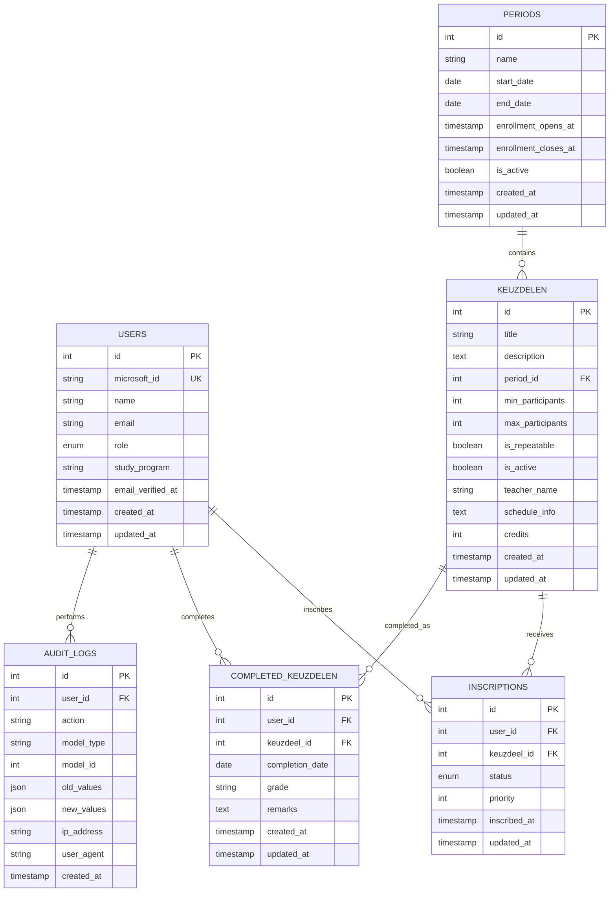

# Database Schema Design - Keuzedeel Website

## Entity Relationship Diagram



## Table Definitions

### 1. Users
```sql
CREATE TABLE users (
    id BIGINT PRIMARY KEY AUTO_INCREMENT,
    microsoft_id VARCHAR(255) UNIQUE NOT NULL,
    name VARCHAR(255) NOT NULL,
    email VARCHAR(255) UNIQUE NOT NULL,
    role ENUM('student', 'admin', 'slber') NOT NULL DEFAULT 'student',
    study_program VARCHAR(255),
    email_verified_at TIMESTAMP NULL,
    created_at TIMESTAMP DEFAULT CURRENT_TIMESTAMP,
    updated_at TIMESTAMP DEFAULT CURRENT_TIMESTAMP ON UPDATE CURRENT_TIMESTAMP,
    
    INDEX idx_microsoft_id (microsoft_id),
    INDEX idx_email (email),
    INDEX idx_role (role),
    INDEX idx_study_program (study_program)
);
```

### 2. Periods
```sql
CREATE TABLE periods (
    id BIGINT PRIMARY KEY AUTO_INCREMENT,
    name VARCHAR(255) NOT NULL,
    start_date DATE NOT NULL,
    end_date DATE NOT NULL,
    enrollment_opens_at TIMESTAMP NOT NULL,
    enrollment_closes_at TIMESTAMP NOT NULL,
    is_active BOOLEAN DEFAULT TRUE,
    created_at TIMESTAMP DEFAULT CURRENT_TIMESTAMP,
    updated_at TIMESTAMP DEFAULT CURRENT_TIMESTAMP ON UPDATE CURRENT_TIMESTAMP,
    
    INDEX idx_dates (start_date, end_date),
    INDEX idx_enrollment_period (enrollment_opens_at, enrollment_closes_at),
    INDEX idx_active (is_active)
);
```

### 3. Keuzedelen
```sql
CREATE TABLE keuzedelen (
    id BIGINT PRIMARY KEY AUTO_INCREMENT,
    title VARCHAR(255) NOT NULL,
    description TEXT,
    period_id BIGINT NOT NULL,
    min_participants INT DEFAULT 15,
    max_participants INT DEFAULT 30,
    is_repeatable BOOLEAN DEFAULT FALSE,
    is_active BOOLEAN DEFAULT TRUE,
    teacher_name VARCHAR(255),
    schedule_info TEXT,
    credits INT DEFAULT 1,
    created_at TIMESTAMP DEFAULT CURRENT_TIMESTAMP,
    updated_at TIMESTAMP DEFAULT CURRENT_TIMESTAMP ON UPDATE CURRENT_TIMESTAMP,
    
    FOREIGN KEY (period_id) REFERENCES periods(id) ON DELETE CASCADE,
    INDEX idx_period (period_id),
    INDEX idx_active (is_active),
    INDEX idx_repeatable (is_repeatable),
    INDEX idx_capacity (min_participants, max_participants)
);
```

### 4. Inscriptions
```sql
CREATE TABLE inscriptions (
    id BIGINT PRIMARY KEY AUTO_INCREMENT,
    user_id BIGINT NOT NULL,
    keuzdeel_id BIGINT NOT NULL,
    status ENUM('pending', 'confirmed', 'waitlist', 'cancelled') DEFAULT 'pending',
    priority INT DEFAULT 1,
    inscribed_at TIMESTAMP DEFAULT CURRENT_TIMESTAMP,
    updated_at TIMESTAMP DEFAULT CURRENT_TIMESTAMP ON UPDATE CURRENT_TIMESTAMP,
    
    FOREIGN KEY (user_id) REFERENCES users(id) ON DELETE CASCADE,
    FOREIGN KEY (keuzdeel_id) REFERENCES keuzedelen(id) ON DELETE CASCADE,
    
    UNIQUE KEY unique_user_keuzdeel (user_id, keuzdeel_id),
    INDEX idx_user_status (user_id, status),
    INDEX idx_keuzdeel_status (keuzdeel_id, status),
    INDEX idx_inscribed_at (inscribed_at),
    INDEX idx_priority (priority)
);
```

### 5. Completed Keuzedelen
```sql
CREATE TABLE completed_keuzedelen (
    id BIGINT PRIMARY KEY AUTO_INCREMENT,
    user_id BIGINT NOT NULL,
    keuzdeel_id BIGINT NOT NULL,
    completion_date DATE NOT NULL,
    grade VARCHAR(10),
    remarks TEXT,
    created_at TIMESTAMP DEFAULT CURRENT_TIMESTAMP,
    updated_at TIMESTAMP DEFAULT CURRENT_TIMESTAMP ON UPDATE CURRENT_TIMESTAMP,
    
    FOREIGN KEY (user_id) REFERENCES users(id) ON DELETE CASCADE,
    FOREIGN KEY (keuzdeel_id) REFERENCES keuzedelen(id) ON DELETE CASCADE,
    
    UNIQUE KEY unique_user_keuzdeel_completed (user_id, keuzdeel_id),
    INDEX idx_user_completion (user_id, completion_date),
    INDEX idx_keuzdeel_completion (keuzdeel_id, completion_date)
);
```

### 6. Audit Logs
```sql
CREATE TABLE audit_logs (
    id BIGINT PRIMARY KEY AUTO_INCREMENT,
    user_id BIGINT,
    action VARCHAR(255) NOT NULL,
    model_type VARCHAR(255) NOT NULL,
    model_id BIGINT NOT NULL,
    old_values JSON,
    new_values JSON,
    ip_address VARCHAR(45),
    user_agent TEXT,
    created_at TIMESTAMP DEFAULT CURRENT_TIMESTAMP,
    
    FOREIGN KEY (user_id) REFERENCES users(id) ON DELETE SET NULL,
    INDEX idx_user_action (user_id, action),
    INDEX idx_model (model_type, model_id),
    INDEX idx_created_at (created_at)
);
```

## Business Logic Implementation

### 1. Inscription Validation Rules
```php
// Check if student can enroll
function canEnroll($userId, $keuzdeelId) {
    // 1. Check if keuzdeel is active
    // 2. Check if enrollment period is open
    // 3. Check if student hasn't completed this keuzdeel
    // 4. Check if student isn't already enrolled
    // 5. Check capacity limits
    // 6. Check if student has max 1 keuzdeel per period
}
```

### 2. Capacity Management
```php
// Get current enrollment count
function getCurrentEnrollment($keuzdeelId) {
    return Inscription::where('keuzdeel_id', $keuzdeelId)
                     ->whereIn('status', ['pending', 'confirmed'])
                     ->count();
}

// Check if keuzdeel is full
function isFull($keuzdeelId) {
    $keuzdeel = Keuzdeel::find($keuzdeelId);
    $current = getCurrentEnrollment($keuzdeelId);
    return $current >= $keuzdeel->max_participants;
}
```

### 3. Waitlist Management
```php
// Add to waitlist
function addToWaitlist($userId, $keuzdeelId) {
    $priority = getNextPriority($keuzdeelId);
    return Inscription::create([
        'user_id' => $userId,
        'keuzdeel_id' => $keuzdeelId,
        'status' => 'waitlist',
        'priority' => $priority
    ]);
}
```

## Index Optimization Strategy

### 1. Performance Critical Queries
- Student enrollment status per period
- Available spots per keuzdeel
- Admin overview of all inscriptions
- Audit trail queries

### 2. Recommended Indexes
```sql
-- Composite indexes for common queries
CREATE INDEX idx_user_period_status ON inscriptions(user_id, status);
CREATE INDEX idx_keuzdeel_enrollment_count ON inscriptions(keuzdeel_id, status);
CREATE INDEX idx_period_keuzdelen ON keuzedelen(period_id, is_active);
CREATE INDEX idx_student_completions ON completed_keuzedelen(user_id, completion_date);
```

## Data Migration Considerations

### 1. Existing Data Import
- Student information from current systems
- Historical keuzedeel data
- Past enrollment records

### 2. Data Validation
- Email format validation
- Microsoft ID format checking
- Date range validation

### 3. Migration Strategy
- Phase 1: Import users and basic keuzedelen
- Phase 2: Import historical completions
- Phase 3: Set up current period enrollments

## Security Considerations

### 1. Data Protection
- PII encryption for sensitive data
- Audit logging for all changes
- Role-based data access

### 2. Input Validation
- SQL injection prevention
- XSS protection
- CSRF tokens

### 3. Backup Strategy
- Daily automated backups
- Point-in-time recovery
- Test restore procedures
